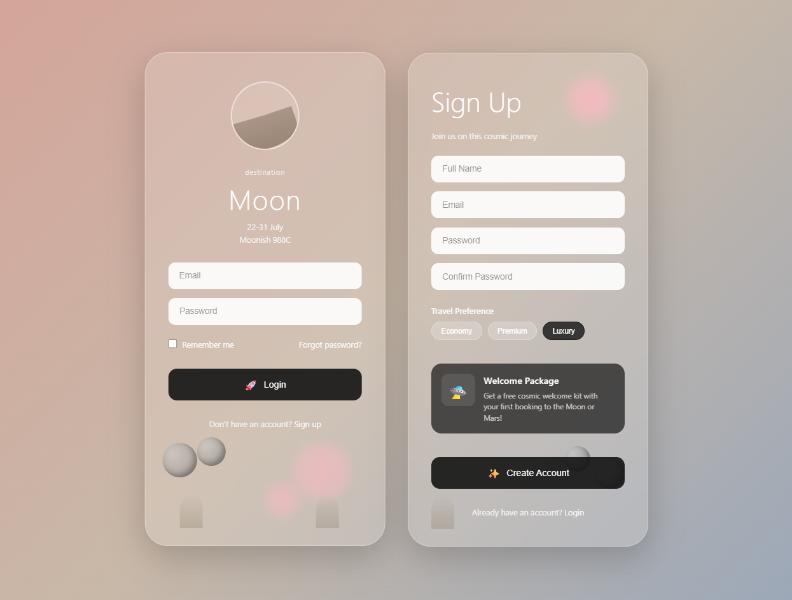

# Space Travel - Sistema de Autenticação 🚀

<div align="center">


**Sistema de autenticação temático para viagens espaciais 🌙**

Interface moderna com design glassmorphism e animações interativas

</div>

---

## Sobre o Projeto

**Space Travel Auth** é um sistema de login e cadastro com temática espacial, apresentando um design moderno com efeito glassmorphism, animações suaves e elementos decorativos que remetem ao espaço e planetas.

### Características Principais

- Design glassmorphism com backdrop blur
- Formulários de Login e Signup lado a lado
- Animações e transições fluidas
- Sistema de notificações personalizadas
- Validação de senha em tempo real
- Efeitos parallax e tilt 3D nos cards
- Elementos decorativos animados (esferas, orbes, grama)
- Sistema de preferências de viagem (Economy, Premium, Luxury)
- Indicador visual de força de senha
- Easter egg com sequência de lançamento espacial
- Totalmente responsivo

---

## Tecnologias Utilizadas

- **HTML5** - Estrutura semântica da página
- **CSS3** - Estilização avançada com glassmorphism, gradientes e animações
- **JavaScript (Vanilla)** - Interatividade e validações
- **CSS Grid & Flexbox** - Layout responsivo
- **CSS Animations** - Animações de elementos decorativos
- **Transform 3D** - Efeitos de tilt e parallax

---

## Preview

<div align="center">



*Telas de Login e Signup lado a lado com tema espacial*

</div>

---

## Funcionalidades

### Formulário de Login
- Campo de email e senha
- Opção "Remember me"
- Link "Forgot password?"
- Botão de submit com feedback visual
- Ícone de planeta animado
- Informações de destino (Lua, data, temperatura)

### Formulário de Signup
- Campos: Nome completo, email, senha e confirmação
- Seleção de preferência de viagem (chips interativos)
- Info box com pacote de boas-vindas
- Validação de senhas correspondentes
- Validação de força de senha (mínimo 6 caracteres)
- Feedback visual em tempo real

### Animações e Interações
- **Efeito Parallax**: Cards se movem sutilmente com o movimento do mouse
- **Tilt 3D**: Cards inclinam em perspectiva 3D ao passar o mouse
- **Elementos Flutuantes**: Esferas e orbes com animação float
- **Ripple Effect**: Efeito de onda nos chips de preferência
- **Input Focus**: Inputs crescem levemente ao receber foco
- **Loading States**: Botões mostram estado de carregamento
- **Notificações**: Sistema toast com animações suaves
- **Planet Rotation**: Superfície do planeta rotaciona continuamente

### Easter Egg
Clique 5 vezes no orbe brilhante (glow orb) para ativar a sequência de lançamento espacial!

---

## Como Rodar o Projeto

### Opção 1: Servidor Local

1. **Clone o repositório**

```bash
git clone https://github.com/erikalaiane/travel-auth.git
```

2. **Entre no diretório do projeto**

```bash
cd travel-auth
```

3. **Abra com um servidor local**

Você pode usar:
- **Live Server** (extensão do VS Code)
- **Python**: `python -m http.server 8000`
- **Node.js**: `npx serve`

4. **Acesse no navegador**

Abra [http://localhost:8000](http://localhost:8000) (ou a porta indicada)

### Opção 2: Abrir Diretamente

Simplesmente abra o arquivo `index.html` no seu navegador preferido.

---

## Estrutura do Projeto

```
travel-auth/
├── index.html           # Estrutura HTML
├── style.css            # Estilos e animações
├── script.js            # Lógica e interatividade
├── preview.png          # Imagem de preview
└── README.md            # Documentação
```

---

## Destaques do Código

### Glassmorphism Effect
```css
background: rgba(255, 255, 255, 0.15);
backdrop-filter: blur(20px);
border: 1px solid rgba(255, 255, 255, 0.3);
```

### Animações Personalizadas
- **Pulse**: Animação do orbe brilhante
- **Float**: Movimento flutuante das esferas
- **Glow**: Pulsação dos orbes de luz
- **Ripple**: Efeito de onda nos botões
- **Launch**: Sequência de lançamento espacial

### Validações
- Senhas devem corresponder
- Senha mínima de 6 caracteres
- Indicador visual de força de senha
- Feedback em tempo real

---

## Responsividade

O projeto é totalmente responsivo e otimizado para:

- **Mobile**: 320px - 767px
- **Tablet**: 768px - 1023px
- **Desktop**: 1024px+

Cards se ajustam automaticamente em telas menores, mantendo toda a funcionalidade e beleza visual.

---

## Paleta de Cores

```css
/* Gradiente de fundo */
background: linear-gradient(135deg, #d4a59a 0%, #c8b8a8 50%, #9ca8b8 100%);

/* Tons de rosa para orbes */
rgba(255, 182, 193, 0.8) - Rosa claro
rgba(255, 192, 203, 0.4) - Rosa suave

/* Elementos escuros */
rgba(20, 20, 20, 0.9) - Botões e info boxes
rgba(139, 119, 101, 0.8) - Tons de marrom/terra
```

---

## Contribuindo

Contribuições são sempre bem-vindas! Para contribuir:

1. Faça um fork do projeto
2. Crie uma branch para sua feature (`git checkout -b feature/MinhaFeature`)
3. Commit suas mudanças (`git commit -m 'Adiciona nova feature'`)
4. Push para a branch (`git push origin feature/MinhaFeature`)
5. Abra um Pull Request

### Ideias para Contribuições
- Adicionar integração com API real de autenticação
- Implementar modo escuro
- Adicionar mais destinos espaciais (Marte, Saturno, etc.)
- Criar página de recuperação de senha
- Adicionar autenticação com redes sociais
- Melhorar acessibilidade (ARIA labels)

---

## Melhorias Futuras

- [ ] Integração com backend real
- [ ] Persistência de dados
- [ ] Mais planetas/destinos
- [ ] Animação de transição entre login/signup
- [ ] Sistema de recuperação de senha funcional
- [ ] Dashboard pós-login
- [ ] Multi-idioma (i18n)

---

## Inspiração

Este projeto foi inspirado na estética de viagens espaciais modernas, combinando elementos futuristas com design minimalista e elegante. O efeito glassmorphism remete às janelas das naves espaciais, enquanto os elementos decorativos criam uma atmosfera imersiva.

---

## Autora

**Erika Laiane**

[](https://github.com/erikalaiane)
[](https://www.linkedin.com/in/erika-laiane-azevedo)
[](mailto:erikalaianeazevedosantos@gmail.com)

---

<div align="center">

Desenvolvido com 💜 por Erika Laiane

</div>